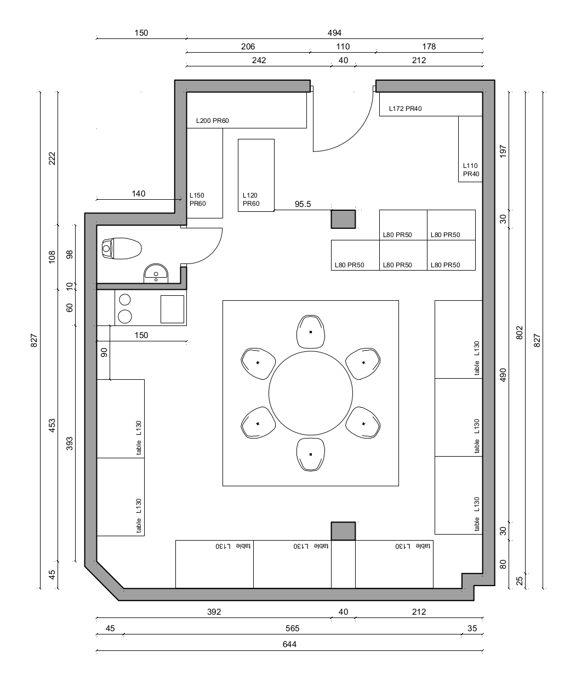

# LINKPing

> Design and implementation of a hackerspace in Linköping, Sweden.

## Goals

Build a place where likeminded people can hang out, hack on different things and learn from each other.

## Layout

Finding a place might be difficult, depending on where you live. The more requirements you have the harder it will get. We decided on the following requirements to use when searching for the place:

* access to electricity and internet (well duh)
* easy access to a bathroom (arguably the most important requirement)
* access to some sort of kitchenette for making coffee and tea, a fridge and place for e.g. a micro wave oven
* it should be affordable (obviously depends on your budget)
* it should be large enough but not too big either (depends on your preferences)

We got a pdf from the landlord, which was enlarged and imported into AutoCAD (thank you [`@gorhgorh`](https://github.com/gorhgorh) and zhi!). This is the result of the original design from paper.

This will most definitely change but we decided on some additional requirements that should be fulfilled:

* there should be an area where you can sit and talk, e.g. a couple of sofas/chairs and a table
* the entrance should have a hallway where you can put your shoes and clothes
* there should be storage for things like cleaning materials, vacuum cleaner etc
* there should be plenty of shelves for storing projects and materials
* there should be several work places with a separate shelf on the wall
* there should be a larger table where several people can sit together
* there should be a video system with a white screen and a projector
* there should be an audio system

## Economics

A boring but unfortunately necessary subject to discuss and keep track of.

### Variable costs

* rent: 28800 SEK/year (excluding VAT)
* electricity: currently no contract and currently unknown
* internet: currently no contract and currently unknown

### Fixed costs

There might be a fixed cost in getting internet set up at all. Currently awaiting information from the landlord. If it's not a big cost, they will pay for it.

## License

All content submitted to this project is licensed under a [`Creative Commons Attribution-ShareAlike 4.0 International License`](https://creativecommons.org/licenses/by-sa/4.0/)
